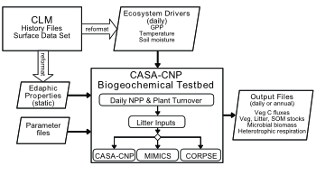

<!-- Start Writing Below in Markdown -->

### Additional Data Sources: 
Beyond LTER, CZO, and NEON sites our synthesis includes data from the:

*

*[Detrital Input and Removal Experiment (DIRT)](https://dirtnet.wordpress.com/)

### Complimentary synthesis efforts: 
Several other synthesis efforts are underway including:

*

*

### Modeling resources:
We're building tools to use the soil biogeochemical testbed with data collected here

*

