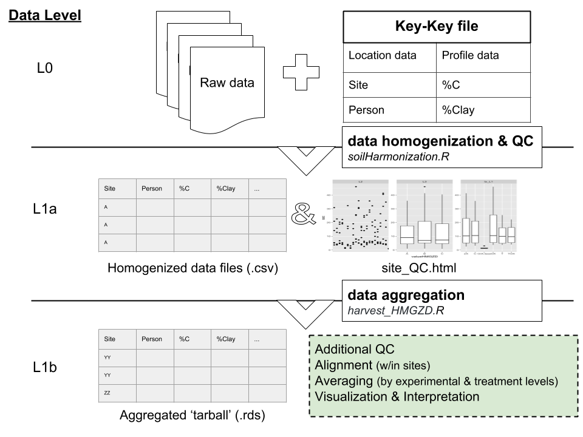

<!-- Start Writing Below in Markdown -->

### Our workflow: 
1) Takes raw data;
2) Homogonizes data into a common format; 
3) Aggregates data into an R object;
4) Aligns data within site;
5) Averages data by location, experimental, and treatment levels;
6) Provides data visualization and interpretation tools.

~ 

### Using the soilHarmonization.R package 

Instructions for using the package can be found here
https://github.com/srearl/soilHarmonization

~ 

### Data aggregation 

Location data are aggregated with the harvest_HMGZD.R package

